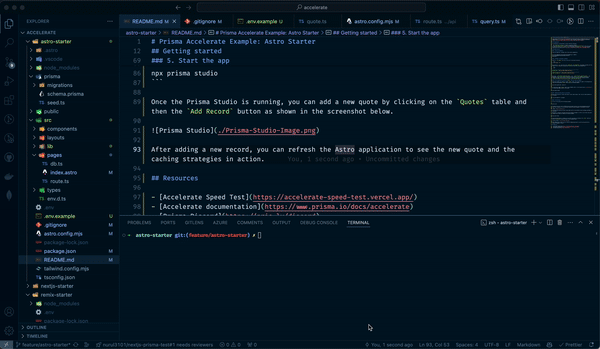
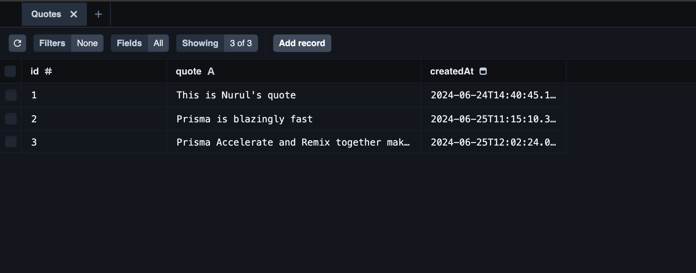

# Prisma Accelerate Example: Astro Starter

This project showcases how to use Prisma ORM with Prisma Accelerate in a Astro application. It [demonstrates](././src/pages/route.ts#L13-16) every available [caching strategy in Accelerate](https://www.prisma.io/docs/data-platform/accelerate/concepts#cache-strategies).

## Prerequisites

To successfully run the project, you will need the following:

- The **connection string** of a publicly accessible database.
- Your **Accelerate connection string** (containing your **Accelerate API key**) which you can get by enabling Accelerate in a project in your [Prisma Data Platform](https://pris.ly/pdp) account (learn more in the [docs](https://www.prisma.io/docs/platform/concepts/environments#api-keys)).

## Getting started

### 1. Clone the repository

Clone the repository, navigate into it and install dependencies:

```
git clone git@github.com:prisma/prisma-examples.git --depth=1
cd prisma-examples/accelerate/astro-starter
npm install
```

### 2. Configure environment variables

Copy the `.env.example` env file in the root of the project directory:

```bash
cp .env.example .env
```

Now, open the `.env` file and set the `DIRECT_URL` and `DATABASE_URL` environment variables with the values of your connection string and your Accelerate connection string respectively:

```bash
# .env

# Accelerate connection string (used for queries by Prisma Client)
DATABASE_URL="__YOUR_ACCELERATE_CONNECTION_STRING__"

# Database connection string (used for migrations by Prisma Migrate)
DIRECT_DATABASE_URL="__YOUR_DATABASE_CONNECTION_STRING__"

```

Note that `__YOUR_DATABASE_CONNECTION_STRING__` and `__YOUR_ACCELERATE_CONNECTION_STRING__` are placeholder values that you need to replace with the values of your database and Accelerate connection strings. Notice that the Accelerate connection string has the following structure: `prisma://accelerate.prisma-data.net/?api_key=__YOUR_ACCELERATE_API_KEY__`.

### 3. Run a migration to create the `Quotes` table and seed the database

The Prisma schema file contains a single `Quotes` model. You can map this model to the database and create the corresponding `Quotes` table using the following command:

```
npx prisma migrate dev --name init
```

You now have an empty `Quotes` table in your database. Next, run the [seed script](./prisma/seed.ts) to create some sample records in the table:

```
npx prisma db seed
```

### 4. Generate Prisma Client for Accelerate

When using Accelerate, Prisma Client doesn't need a query engine. That's why you should generate it as follows:

```
npx prisma generate --no-engine
```

### 5. Start the app

You can run the app with the following command:

```
npm run dev
```

The application will start on PORT 4321 and you should be able to see the performance and other stats (e.g. cache/hit) for the different Accelerate cache strategies at the bottom of the UI:



This application queries the most recent Quote with all the different cache strategies available in Accelerate.

Optionally, to add your own quote and see the caching strategies in action, you can add a new quote through Prisma Studio by running the following command:

```
npx prisma studio
```

Once the Prisma Studio is running, you can add a new quote by clicking on the `Quotes` table and then the `Add Record` button as shown in the screenshot below.



After adding a new record, you can refresh the Astro application to see the new quote and the caching strategies in action.

## Resources

- [Accelerate Speed Test](https://accelerate-speed-test.vercel.app/)
- [Accelerate documentation](https://www.prisma.io/docs/accelerate)
- [Prisma Discord](https://pris.ly/discord)
